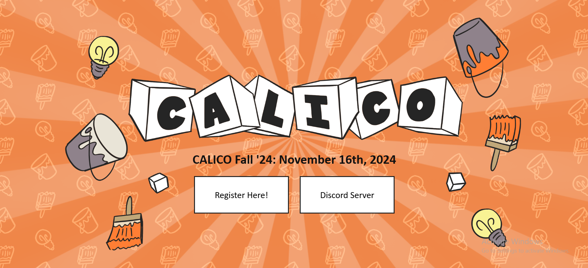

# UC Berkeley Coding Competition 2024  

This repository contains my solutions to the problems I tackled during the UC Berkeley Coding Competition 2024. The competition was a thrilling experience filled with innovative and challenging problems. Below, you'll find a summary of the problems and the code implementations.

---


## Repository Structure  

```plaintext
.
├── CALICOnstruction/
│   ├── main.py        # Solution to the CALICOnstruction problem
│   └── Pics           # For understanding the problem
├── Coding90sLootList/
│   ├── main.py        # Solution to the Coding 90s in Loot List problem
│   └── Pics           # For understanding the problem
├── OREREREREOOOOOOOOO/
│   ├── main.py        # Solution to the OREREREREOOOOOOOOO problem
│   └── Pics           # For understanding the problem
├── HumanInstrumentalityinator/
│   ├── main.py        # Solution to the Human Instrumentality-inator problem
│   └── Pics           # For understanding the problem
└── README.md          # This file

```
---

## My Problem Table:


## My Ranking:


